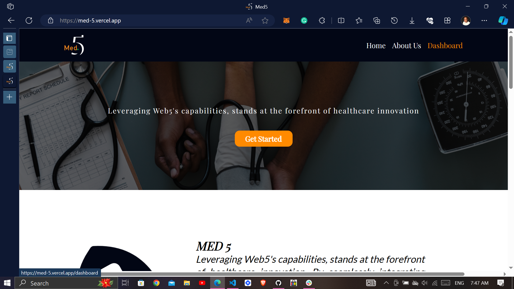
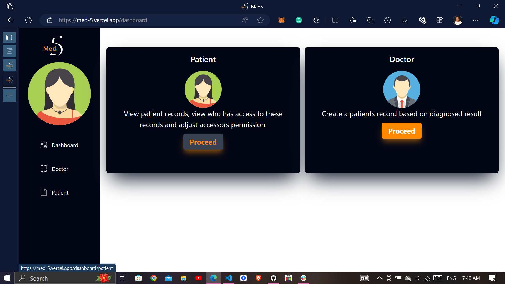
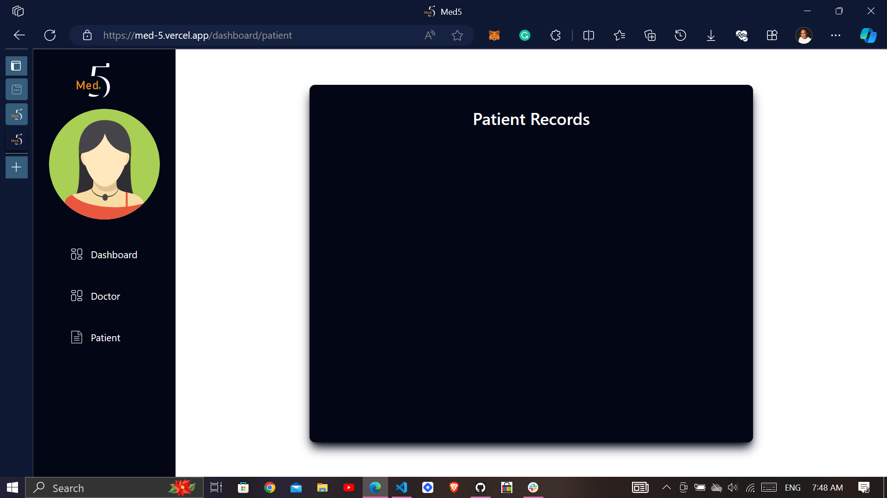
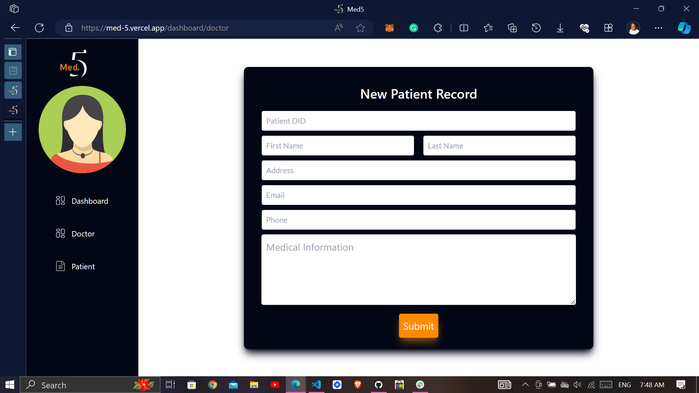
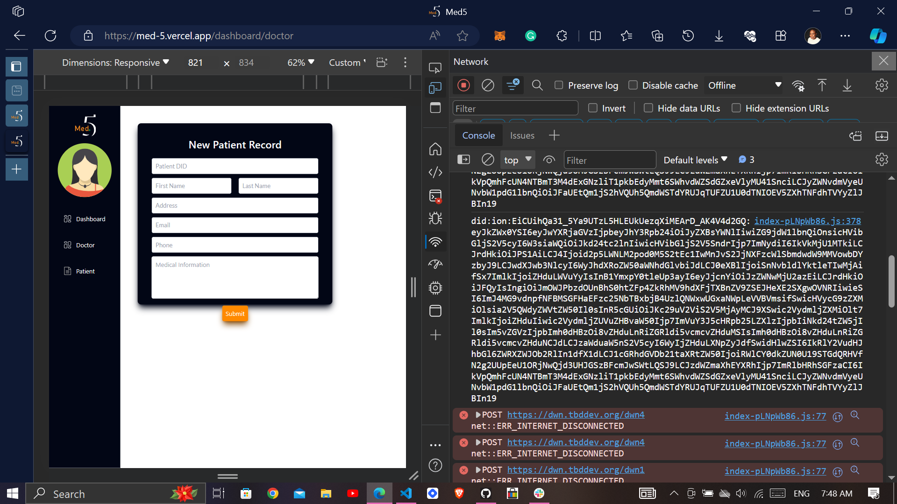

# Med 5

# Description
Med 5 is an healthcare service that manages the database of the patients and also keep track of their diagnosis status and the progress of the treatment. This service was created as a due to the pressing issues in :
1. managing the database of the patients
2. inaccessibility of patients' comprehensive treatment plans, diagnoses, and medical histories. 
 
Med 5 is dedicated to transforming healthcare data management through the introduction of a secure and decentralized electronic health record system (EHR). This EHR system, intricately built on Web5 components, will empower record officers with seamless navigation to retrieve both historical and current patient information. The incorporation of Decentralized Identifiers (DIDs) ensures a streamlined and secure process, reinforcing the confidentiality and integrity of patient data.
Moreover, This solution embraces Web5's decentralized architecture and deploys cryptographic security measures to fortify patient data against unauthorized access and potential data breaches. This commitment to improved data security and privacy aligns with global standards, fostering trust in the healthcare ecosystem.
In addition to data security, this EHR system implements rigorous data quality control measures. This ensures the accuracy and completeness of patient records, promoting reliable and comprehensive healthcare information.

# 🤔 How to use it ?

## 1. Navigation:

Click on the link to get started with "Dashboard" in yellow 

## 2. What the dashboard entails

The first with the heading *Patients* display patient records, who has access to these records and adjust accessors permission clicking on the _proceed_ button

The second with the heading *Doctors* display the form for registering a new patient using the patient DID, their basic information including their name, address, email address, and phone number and their medical records. 

## 3. Getting the Patient DID 

for now the patient can get their DID from their console which is available as soon as they login to the website. 

The patient should copy the DID url and use it for the registration procedure.

